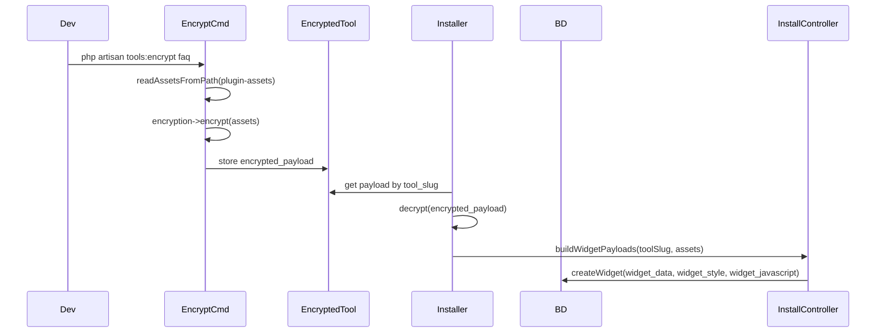

# FAQ encryption, server-fetch, and installer setup flow

## Current flow (reference)

- Assets are keyed by filename (e.g. `admin.php`, `admin.css`). [ToolPayloadBuilder](app/Services/ToolPayloadBuilder.php) maps them to `widget_data`, `widget_style`, `widget_javascript` per widget. [ToolEncryptionService](app/Services/ToolEncryptionService.php) uses Laravel `Crypt` (app key only). [InstallController](app\Http\Controllers\InstallController.php) gets assets via `getToolAssets()` then builds payloads and sends to BD.

---

## 1. License-key-bound encryption

**Goal:** Encrypt client-side payload so only a valid license token can decrypt (e.g. widget uses token at runtime to decrypt).

- **New service** (e.g. `App\Services\LicenseBoundEncryption`):
  - `encrypt(string $payload, string $licenseToken): string` — derive key from `hash_hmac('sha256', $licenseToken, config('app.key'))`, then encrypt (e.g. OpenSSL or Laravel Crypt with that key). Output base64 or opaque string.
  - `decrypt(string $encrypted, string $licenseToken): string` — same key derivation, decrypt.
- Use this only for **client-installed** content (helper blob, base64’d main PHP). Do not replace existing `EncryptedTool` storage (that stays app-key-only); use license-bound encryption when **building the payload** sent to BD for service tools that opt in.

---

## 2. FAQ delivery mode: base64 PHP, helper, server-fetch, CSS

**Goal:** For FAQ (and optionally other tools), before install: main widget PHP as base64; a small “helper” PHP (encrypted with license key) that fetches HTML/JS from your server; CSS plain or PHP that echoes decoded CSS; real JS not stored in BD, fetched by helper.

**Config:** Extend [config/tools.php](config/tools.php) per tool, e.g.:

- `delivery_mode`: `default` (current behavior) | `server_fetch` (FAQ-style).
- For `server_fetch`: optionally `server_fetch_keys` (which asset keys are fetched from server, e.g. HTML/JS) and which are “main PHP” vs “helper” vs “CSS”.

**Build pipeline (artisan or install-time):**

- **Main plugin PHP** (e.g. `admin.php`, `global-renderer.php`): encode with base64 (and optionally compress) before putting into payload. Client widget will decode and run (or decode server-side and send to client depending on where you want execution).
- **Helper PHP:** Small stub that contains:
  - Base URL for server (injected at build/install time from “Setup tool” or config).
  - Logic to fetch HTML/JS from `{base_url}/...` (e.g. with license token in header or query).
  - This stub is **encrypted with license-bound encryption** so the client does not see the URL or logic in plain text.
- **CSS:** Either leave as plain text in `widget_style`, or (if BD CSS tab supports PHP) store a one-liner PHP that base64-decodes and echoes CSS so “CSS” is not readable in BD.
- **JS:** Do not put real JS in `widget_javascript`. Put empty or minimal loader. Real JS URL is known to the helper and fetched from your server.

**Where to implement:**

- **New class** (e.g. `App\Services\FaqPayloadPreparer` or generic `ServerFetchPayloadPreparer`) that, given raw `$assets` and options (license token, server base URL, custom URL):
  - Builds “main PHP” content as base64.
  - Builds helper PHP string, encrypts it with `LicenseBoundEncryption::encrypt($helperCode, $licenseToken)`.
  - Builds `widget_data` = encrypted helper + (if needed) base64 main PHP or a single combined blob (design choice: one blob per widget that client decodes with token).
  - Builds `widget_style` = raw CSS or PHP decoder snippet.
  - Builds `widget_javascript` = '' or minimal.
- **ToolPayloadBuilder** (or InstallController): for tools with `delivery_mode === 'server_fetch'`, call this preparer **after** getting decrypted assets and **before** building the final payloads sent to BD. So flow: get assets from EncryptedTool (decrypt with app key) → preparer produces modified assets (base64, encrypted helper, etc.) → buildWidgetPayloads uses those → send to BD.

---

## 3. Setup tool: upload files to server + custom URL

**Goal:** Optional installer step “Setup tool” where the user uploads files (e.g. HTML, JS) to be hosted on your server, with an optional custom base URL. These URLs are then used by the encrypted helper when fetching HTML/JS.

- **Storage:** Store uploaded files under `storage/app/tool-assets/{tool_slug}/` (or a dedicated disk). Keep a mapping of logical name → stored path (e.g. `faq-render.html` → `tool-assets/faq/abc123.html`).
- **DB:** New table (e.g. `tool_server_assets`) or config-backed storage:
  - `tool_slug`, `file_name`, `storage_path` (or `disk` + path), `public_url` (optional; if custom URL is used, this is the full URL for that file).
  - Optional: `custom_base_url` per tool_slug so all assets for that tool are under `{custom_base_url}/{file_name}` or similar.
- **Routes:** 
  - Authenticated route to **serve** files (e.g. `GET /admin/tool-assets/{tool_slug}/{file_name}`) that checks license or API key so only valid clients can download. Return file contents with appropriate headers.
  - If you need public CDN URLs, support storing a `custom_base_url` and generating links accordingly; otherwise use app URL + route above.
- **UI (installer):** New section or step “Setup tool” (shown when tool has `delivery_mode === 'server_fetch'` or a flag like `supports_server_upload`):
  - List of file inputs (or multi-file upload) for “server files” (e.g. HTML, JS).
  - Optional text input “Custom base URL” (e.g. `https://cdn.example.com/tool-assets/faq`).
  - On submit: store files, save metadata and optional custom_base_url. Then user continues to “Install” step.
- **Integration:** When building the FAQ (server_fetch) payload, read `tool_server_assets` (or equivalent) to get the base URL and file names; inject base URL into the helper template so the encrypted helper knows where to fetch. Use custom_base_url when set, else app URL + route path.

---

## 4. Install flow with setup and license-bound encryption

- **Order of operations:**
  1. User selects tool (e.g. FAQ), enters BD credentials, license token (for service tools).
  2. **Optional:** If tool has server-fetch and “Setup tool” is used: user uploads server files and optionally sets custom base URL; save to storage and DB.
  3. **Install:** Get assets (from EncryptedTool for service tools). If tool is `server_fetch`, get server base URL and file list from DB/config, then run `ServerFetchPayloadPreparer` with license token and server URLs; produce modified assets. Optionally encrypt client payload (helper + base64 PHP) with `LicenseBoundEncryption::encrypt(..., $licenseToken)`. Build widget payloads and send to BD (create/update widgets).
- **Existing EncryptedTool:** Unchanged: still stores app-key-encrypted full asset set. The “license-bound” step is applied at **install time** when building the payload sent to BD, not when storing in `encrypted_tools`.

---

## 5. Artisan / build pipeline

- **EncryptToolCommand** [app/Console/Commands/EncryptToolCommand.php](app/Console/Commands/EncryptToolCommand.php): Keep as-is for producing the app-key-encrypted blob in `encrypted_tools`. FAQ-specific “base64 + helper” can be done either:
  - **At encrypt time:** Build a “delivery” blob that already contains base64 main PHP and a **template** helper (with placeholder for server URL). At install time, inject server URL and license-encrypt the helper. Or
  - **At install time only:** Decrypt assets from DB, then run preparer (base64, build helper with server URL, license-encrypt helper) and build payload. Prefer **install-time** so server URL and license token are known and no need to store multiple blobs per tool.

---

## 6. File and config changes summary

| Area                                                            | Action                                                                                                                                                                                                                                                                                             |
| --------------------------------------------------------------- | -------------------------------------------------------------------------------------------------------------------------------------------------------------------------------------------------------------------------------------------------------------------------------------------------- |
| New service                                                     | `LicenseBoundEncryption` (encrypt/decrypt with key derived from license token).                                                                                                                                                                                                                    |
| New service                                                     | `ServerFetchPayloadPreparer` (or `FaqPayloadPreparer`) to build base64 PHP, encrypted helper, CSS/JS handling using server URL and license token.                                                                                                                                                  |
| [config/tools.php](config/tools.php)                            | Add per-tool `delivery_mode` and optional `server_fetch` options for FAQ.                                                                                                                                                                                                                          |
| [ToolPayloadBuilder](app/Services/ToolPayloadBuilder.php)       | Either extend or call preparer from InstallController when `delivery_mode === 'server_fetch'` and pass preparer output into existing buildWidgetPayloads.                                                                                                                                          |
| [InstallController](app\Http\Controllers\InstallController.php) | For service + server_fetch: resolve server base URL from tool_server_assets/custom URL; call preparer with assets, license token, base URL; use resulting assets for buildWidgetPayloads. Add optional “Setup tool” step (same page or previous step): handle file upload, save to storage and DB. |
| New migration                                                   | `tool_server_assets` (tool_slug, file_name, storage_path, public_url or custom_base_url).                                                                                                                                                                                                          |
| New routes                                                      | POST upload for setup; GET serve files (auth’d).                                                                                                                                                                                                                                                   |
| Install form UI                                                 | [resources/views/install/form.blade.php](resources/views/install/form.blade.php) (or admin install flow): add “Setup tool” section when tool supports it (file upload + custom base URL); then “Install” uses stored URLs in preparer.                                                             |

---

## 7. Clarifications to confirm before implementation

- **Client-side decryption:** The widget on the client BD site must have access to the license token to decrypt the helper (and optionally the main PHP). Confirm how the token is provided: shortcode parameter, BD settings field, or call-back to your server (e.g. validate domain + license and return decryption key).
- **BD CSS tab and PHP:** Confirm that the BD widget “CSS” field can execute PHP. If it only stores static CSS, the “PHP base64 decode for CSS” option is not usable and CSS should remain plain.
- **Custom URL:** Whether “custom URL” is strictly a full base URL you provide (e.g. CDN), or whether the app should also support “store files in app and serve from same domain” only (no custom URL). Plan above supports both: default = app route; optional custom_base_url override.

